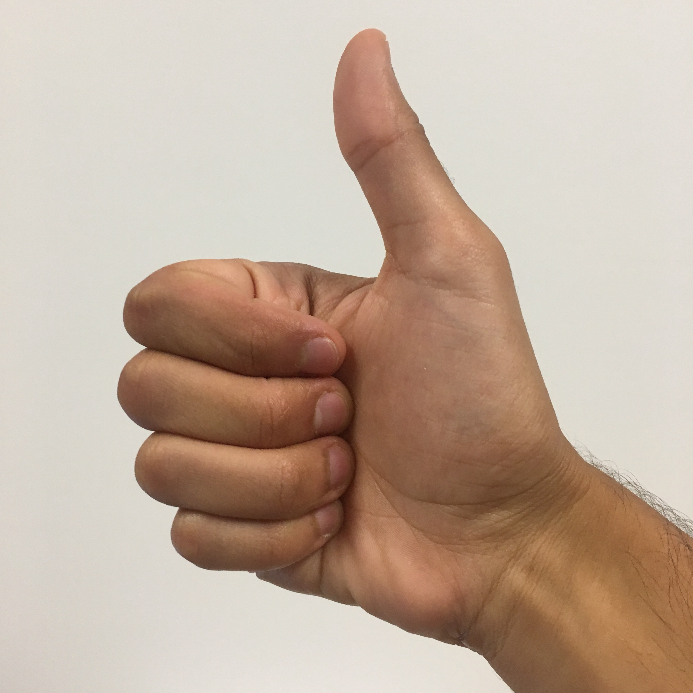
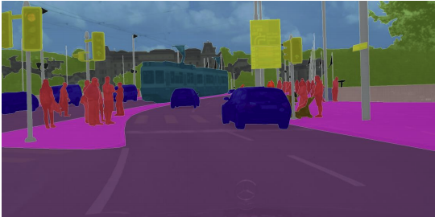
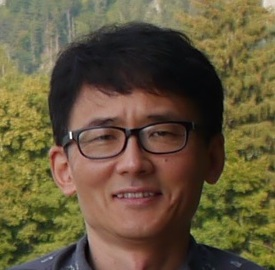
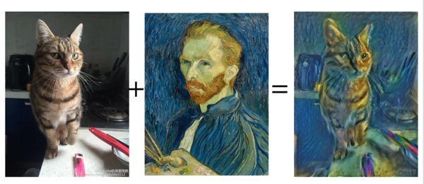

# Jung Soh

## Projects
<table>
  <tr align='center'>
    <td>
      <a href='https://jungsoh.github.io/dnn-cat-vs-noncat-classification'>
         Cat vs non-cat classification (deep neural network)</a>
    </td>
    <td>
      <a href='https://jungsoh.github.io/dnn-sign-language-recognition'>
         Sign language recognition (deep neural network)</a>
    </td>
    <td>
      <a href='https://jungsoh.github.io/cnn-face-mood-classification'>
         Face mood classification (convolutional neural network)</a>
    </td>
    <td>
      <a href='https://jungsoh.github.io/cnn-sign-language-recognition'>
       Sign language recognition (convolutional neural network)</a>
    </td>
  </tr>
  <tr align='center'>
    <td>
      <a href='https://jungsoh.github.io/resnet-sign-language-recognition'>
         Sign language recogntion (residual neural network)</a>
    </td>
    <td>
      <a href='https://jungsoh.github.io/tl-mobilenetv2-alpaca-vs-nonalpaca-classification'>
         Alcapa vs non-alcapa classification (transfer learning with MobileNetV2)</a>
    </td>
    <td>
       <a href='https://jungsoh.github.io/yolo-car-detection-for-autonomous-driving'>
         Car detection for autonomous driving (YOLO algorithm)</a>
    </td>
    <td>
       <a href='https://jungsoh.github.io/unet-semantic-image-segmentation'>
         Semantic image segmentation (U-Net)</a>
    </td>
  </tr>
  <tr align='center'>
    <td>
       <a href='https://jungsoh.github.io/facenet-face-verification-and-face-recognition'>
         Face verification and face recognition (FaceNet)</a>
    </td>
    <td>
       <a href='https://jungsoh.github.io/nst-merging-content-and-style'>
          Merging content and style (neural style transfer)</a>
    </td>
    <td>
    </td>
    <td>
    </td>
  </tr>
</table>

[About me](#about-me)

## About me
    
I have worked in the field of biological data analysis for the last 15 years, dealing mostly with vast amounts of genomic data for humans and other organisms. In my most recent enterprise position, I designed and built a medical diagnosis product, where prediction of disease onset by machine learning was the key idea. I am actively seeking a data science or machine learning role in other industries as well as biotech, where I can leverage my data analysis experience and computing skills to tackle AI problems.

I have solid foundation in computing skills required to excel in data science and machine learning. I have experience building target prediction pipelines using open-source tools, including Python, SQL, R, Java and ML/DL frameworks such as TensorFlow. I am also eagerly expanding my machine learning and AI skill sets.

My earlier work before biological data analysis was on computer vision, including object detection, video processing and face/gesture recognition, with about 13 years of experience. I am updating these foundational skills in the context of deep learning to be able to solve significant computer vision problems with deep neural networks.

I have experience managing several multi-disciplinary teams and collaborated with subject matter experts with diverse expertise, including statisticians, biologists, IT administrators, and project managers.

## Teaching
  
While at [Graz University of Technology](https://tugraz.at/en/home) and earlier at the [University of Calgary](https://ucalgary.ca), I have developed material for and taught courses in Python/R/Bash scripting, bioinformatics labs, and special topics in bioinformatics.

- [Introductory scripting course](https://jungsoh.github.io/intro-scripting-course)
- [Bioinformatics lab course](https://jungsoh.github.io/bioinformatics-lab-course)
- [High-throughput sequence data handling course](https://jungsoh.github.io/high-throughput-sequence-data-handling-course)
- [Transcriptomics course](https://jungsoh.github.io/transcriptomics-course)

## Publications
I have published extensively with my work on biological data analysis and computer vision. Most of my publications can be accessed through my [Google Scholar](https://scholar.google.ca/citations?user=52h5BqQAAAAJ&hl=en).

## Patents
I am an inventor on several issued US patents. The fields of invention include molecular diagnosis of disease, biometric identification (signature and face), camera motion detection, and content-based image retrieval.

- [Methods for treating and detecting sepsis in humans](https://patft.uspto.gov/netacgi/nph-Parser?Sect1=PTO1&Sect2=HITOFF&d=PALL&p=1&u=%2Fnetahtml%2FPTO%2Fsrchnum.htm&r=1&f=G&l=50&s1=10793906.PN.&OS=PN/10793906&RS=PN/10793906), US Patent 10,793,906, Oct 6, 2020
- [Apparatus for online signature verification using pattern transform technique and method therefor](https://patft.uspto.gov/netacgi/nph-Parser?Sect1=PTO1&Sect2=HITOFF&d=PALL&p=1&u=%2Fnetahtml%2FPTO%2Fsrchnum.htm&r=1&f=G&l=50&s1=7454042.PN.&OS=PN/7454042&RS=PN/7454042), US Patent 7,454,042, Nov 18, 2008
- [Face detecting system and method using symmetric axis](https://patft.uspto.gov/netacgi/nph-Parser?Sect1=PTO1&Sect2=HITOFF&d=PALL&p=1&u=%2Fnetahtml%2FPTO%2Fsrchnum.htm&r=1&f=G&l=50&s1=7426287.PN.&OS=PN/7426287&RS=PN/7426287), US Patent 7,426,287, Sep 16, 2008
- [Method and apparatus for estimating camera motion](https://patft.uspto.gov/netacgi/nph-Parser?Sect1=PTO1&Sect2=HITOFF&d=PALL&p=1&u=%2Fnetahtml%2FPTO%2Fsrchnum.htm&r=1&f=G&l=50&s1=6710844.PN.&OS=PN/6710844&RS=PN/6710844), US Patent 6,710,844, Mar 23, 2004
- [Image retrieval system and method using image histogram](https://patft.uspto.gov/netacgi/nph-Parser?Sect1=PTO1&Sect2=HITOFF&d=PALL&p=1&u=%2Fnetahtml%2FPTO%2Fsrchnum.htm&r=1&f=G&l=50&s1=6621926.PN.&OS=PN/6621926&RS=PN/6621926), US Patent 6,621,926, issued Sep 16, 2003

## Education
- Ph.D. Computer Science, University at Buffalo
- M.S. Computer Science, University at Buffalo
- B.S. Electrical Engineering, University of Wisconsin-Madison

## Certifications
- [Machine Learning with TensorFlow on Google Cloud Specialization](https://www.coursera.org/account/accomplishments/specialization/certificate/GV5XVN7LY8FQ), Coursera, by Google Cloud, Dec 2021
- [DeepLearning.AI TensorFlow Developer Professional Certificate](https://www.coursera.org/account/accomplishments/specialization/certificate/4Y69NCMCBNW3), Coursera, by DeepLearning.AI, Oct 2021
- [Deep Learning Specialization](https://www.coursera.org/account/accomplishments/specialization/certificate/AVQ6HFNUEJJ8), Coursera, by DeepLearning.AI, Oct 2021
- [Introduction to Git and GitHub](https://www.coursera.org/account/accomplishments/certificate/45VRDQRQJ8WD), Coursera, by Google, Nov 2021
- [Advance Your Skills in Predictive Analytics](certs/predictive_analytics.pdf), LinkedIn Learning Path, Apr 2021
- [Understanding Cloud Fundamentals](certs/cloud_fundamentals.pdf), LinkedIn Learning Path, Apr 2021
- [Sun Certified Web Component Developer for the Java 2 Platform, Enterprise Edition 1.4](certs/scwcd14.pdf), Sun Microsystems, Oct 2005
- [Sun Certified Programmer for the Java 2 Platform, Standard Edition 5.0](certs/scjp50.pdf), Sun Microsystems, Jul 2005

## More information
For more information about me, you can see my [LinkedIn](https://www.linkedin.com/in/jungsoh/) and [GitHub](https://github.com/jungsoh).
